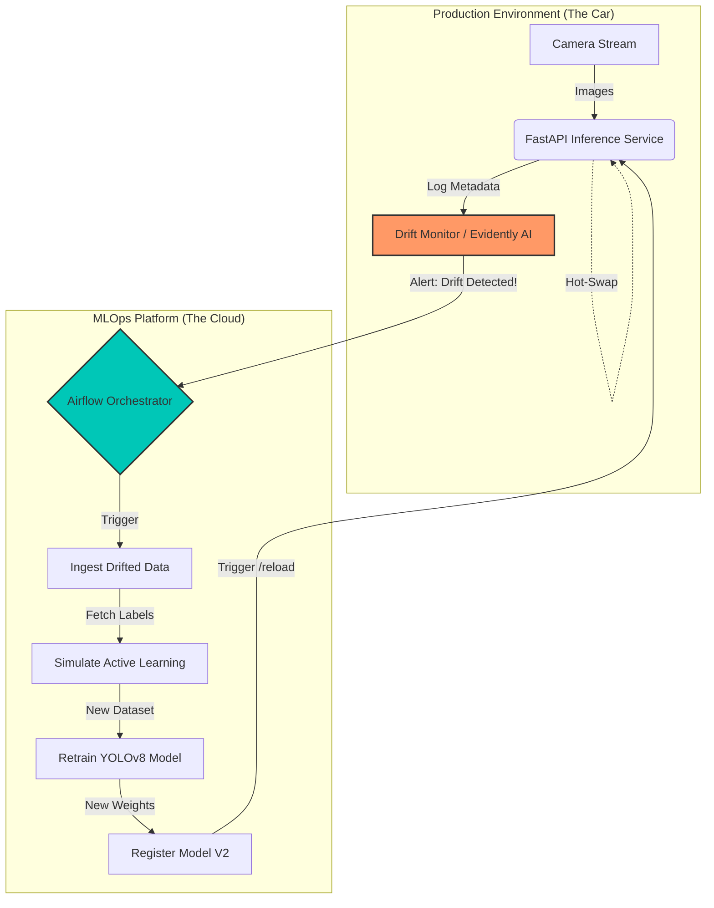
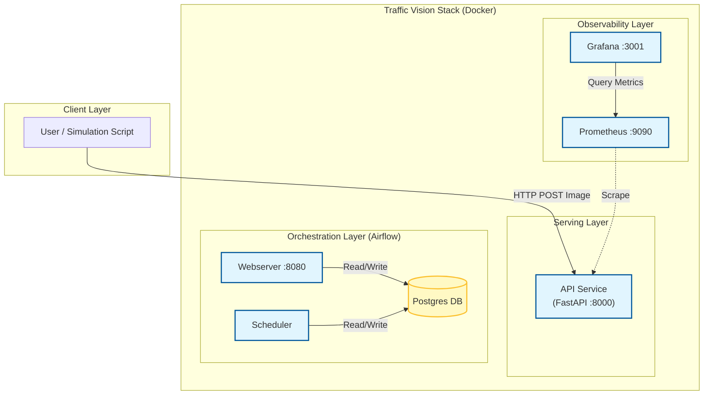

# 🚗 Traffic Vision (Prototype)
*A "Self-Correcting" Object Detection Pipeline (PoC)*


> **"The model works on my machine" is easy.** 
> **"The model fixes itself when it fails in production" is hard.**
> *This is a prototype I built to explore the latter.*

---

## 🎥 The Concept
In a real job, I don't want to wake up at 3 AM to retrain a model because it started raining.
This system **detects the failure** (Drift) and **fixes itself** (Retraining + Hot-Swap).


---

## 🏗️ Architecture: The "Self-Correcting" Loop

This isn't just a static script. It's a living pipeline that separates concerns between rapid inference and robust backend training.



### 🏗️ Infrastructure Architecture (Docker Services)



---

## 🧐 Why This Project?

I kept seeing MLOps tutorials that were just "here's how to deploy a Flask app."
But in my experience, the hard part is **keeping the model relevant** after deployment.

**Key Problems Solved:**
1.  **Data Drift**: Automating the detection of input shifts (e.g., Lighting changes).
2.  **Continuous Improvement**: Closing the loop between inference and retraining without manual intervention.
3.  **Zero Downtime**: Implementing a "Hot-Swap" mechanism to update the model without killing the container.

---

## 🚀 Quick Start
Get the entire stack running in **3 commands**.

### Prerequisites
*   Docker Desktop
*   Python 3.12 (for the client simulation)

### Installation
1.  **Clone the Repository**
    ```bash
    git clone https://github.com/yourusername/traffic-vision.git
    cd traffic-vision
    ```

2.  **Launch the Infrastructure**
    *Starts Airflow, MLflow, MinIO (S3), and the API service.*
    ```bash
    docker-compose up -d --build
    ```
    *Wait ~2 minutes for all services to initialize.*

3.  **Run the Simulation**
    *This script simulates a camera. It sends day images, then switches to night images to trigger the drift alarm.*
    ```bash
    pip install -r requirements.txt
    python src/simulate.py
    ```

---

## 🛠️ Tech Stack Deep Dive
I used standard tools because I wanted reliability, not hype.

### 1. DataOps (DVC)
*   **Why?**: Git is for code, DVC is for data. I need to know exactly which 10GB of images trained Model V1 vs V2.
*   **Workflow**: The pipeline "checkouts" the exact dataset version needed for retraining.

### 2. Orchestration (Airflow)
*   **Why?**: Replacing brittle CRON scripts. Airflow manages dependencies (e.g., "Don't train until data ingest finishes").
*   **Access UI**: `http://localhost:8080` (User: `admin`, Pass: `admin`)

### 3. Monitoring (Evidently AI / Scipy)
*   **Why?**: To maximize statistical rigor. We use **KS-Tests** to calculate the distance between the "Training" distribution and "Live" distribution.
*   **Logic**: If `p_value < 0.05`, we declare drift and wake up the retraining pipeline.

### 4. Serving (FastAPI + ONNX + Hot-Swap)
*   **Why?**: PyTorch is too heavy for edge inference.
*   **Optimization**: Models are converted to **ONNX** for <50ms latency.
*   **Hot-Swap**: The API has a `/reload` endpoint that updates the model in memory without restarting the container.

---

## 🧠 Advanced Usage

### Customizing Drift Sensitivity
The system uses statistical tests to detect drift. You can tune the sensitivity in `src/ops/detect_drift.py`.
-   **Increase Sensitivity**: Increase the p-value threshold.
-   **Decrease Sensitivity**: Decrease it if you see too many false alarms.

### Adjusting Retraining Parameters
The Airflow DAG (`dags/retraining.py`) controls the training loop.
-   **Epochs**: Default is 10. Increase for better accuracy, decrease for faster debugging.
-   **Batch Size**: Adjust based on your GPU memory.

---

## 🐛 Troubleshooting

### Common Issues
*   **"Permission Denied" (Docker)**:
    *   *Fix*: Run `sudo usermod -aG docker $USER` and restart your session.
*   **"Port 8080 already in use"**:
    *   *Cause*: Another service (like Jenkins) is using port 8080.
    *   *Fix*: Change the Airflow port in `docker-compose.yml`.
*   **"Model Reload Failed"**:
    *   *Cause*: The API container might be busy or the model file wasn't fully written.
    *   *Check*: Look at `docker logs traffic-vision-api-1`.

---

## 📂 Project Structure

```bash
traffic-vision/
├── dags/                # Airflow Pipelines (The Brain)
│   └── retraining.py    # The self-correction logic
├── src/                 # Application Source Code
│   ├── app.py           # FastAPI Inference Server (w/ Hot-Swap)
│   ├── ops/             # MLOps Logic
│   │   └── detect_drift.py  # Statistical monitoring
│   └── train.py         # YOLO training script
├── docker-compose.yml   # Infrastructure Definition
└── Dockerfile           # App Container
```

---

## 📜 License
MIT License. Free to use for educational purposes.
