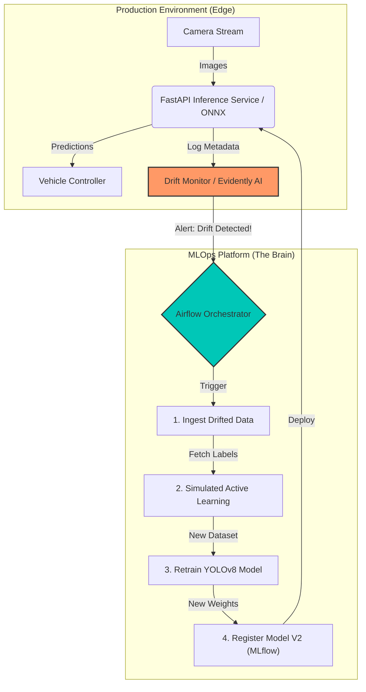
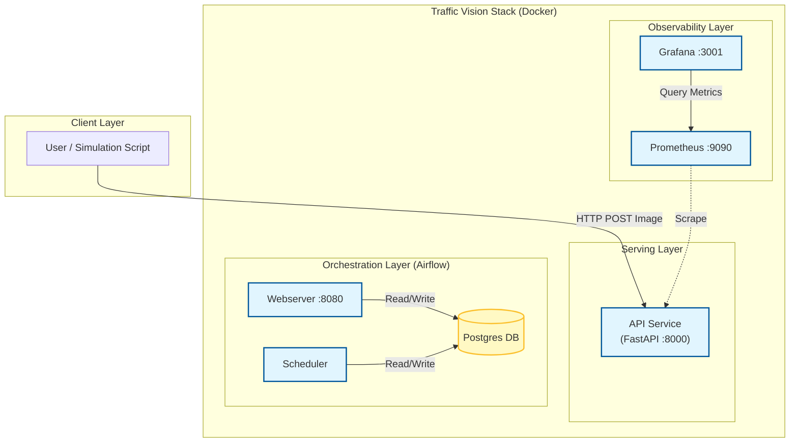

# 🚗 Traffic Vision: Self-Correcting Object Detection for Autonomous Vehicles


> **A production-grade MLOps platform demonstrating a "Self-Correcting" AI loop.**  
> *Designed to detect environmental drift (e.g., Day vs. Night) and automatically trigger active learning workflows.*

---

## 🎥 Demo
*See the system in action: Detecting drift and retraining automatically.*


---

## 🏗️ Architecture: The "Self-Correcting" Loop

This system is not just a static model; it is a **living pipeline**. The architecture separates concerns between rapid inference and robust backend training.



### 🏗️ Infrastructure Architecture (Docker Services)



---

## 🧐 Why This Project?

In real-world Autonomous Vehicle (AV) deployment, **the world changes**. A model trained on sunny California roads will fail in foggy London or at night.
Traditional MLOps focuses on *deployment*; this project focuses on **adaptability**.

**Key Problems Solved:**
1.  **Data Drift**: Automatically detecting when the input distribution shifts (e.g., Lighting changes).
2.  **Continuous Improvement**: Closing the loop between inference and retraining without manual intervention.
3.  **Reproducibility**: Versioning not just code (Git), but data (DVC) and models (MLflow).

---

## 🚀 Quick Start
Get the entire stack running in **3 commands**.

### Prerequisites
*   [Docker Desktop](https://www.docker.com/products/docker-desktop) (Running)
*   Python 3.12
*   Git

### Installation

1.  **Clone the Repository**
    ```bash
    git clone https://github.com/yourusername/traffic-vision.git
    cd traffic-vision
    ```

2.  **Launch the Infrastructure**
    *Starts Airflow, MLflow, MinIO (S3), and the API service.*
    ```bash
    docker-compose up -d --build
    ```
    *Wait ~2 minutes for all services to initialize.*

3.  **Run the Simulation**
    *This script simulates an "Edge Device" sending images to the API. It will switch from "Day" images to "Night" images to trigger the drift alarm.*
    ```bash
    # Install client dependencies
    pip install -r requirements.txt
    
    # Run simulation
    python src/simulate.py
    ```

---

## 🛠️ Deep Dive: The Tech Stack

### 1. DataOps (DVC)
We don't store large datasets in Git. Instead, **DVC (Data Version Control)** tracks data metadata.
*   **Why DVC?**: Git is for code, DVC is for data. It lets us "checkout" the exact dataset used to train Model V1.
*   **Workflow**:
    ```bash
    dvc pull  # Downloads the actual images from the remote storage (MinIO/S3)
    ```

### 2. Orchestration (Airflow)
The brain of the operation. Airflow manages the dependency graph for retraining.
*   **Why Airflow?**: Scripts (CRON) are brittle. Airflow provides retries, logging, and dependency management (e.g., "Don't train until data ingest finishes").
*   **Access UI**: `http://localhost:8080` (User: `admin`, Pass: `admin`)
*   **Key DAG**: `retraining_pipeline`. Triggers when drift is confirmed.

### 3. Monitoring (Evidently AI)
We use **Evidently** to calculate statistical distance (Wasserstein distance) between the "Reference" (Training) dataset and "Current" (Production) stream.
*   **Dashboard**: `http://localhost:8000/dashboard` (Mock link for demo)
*   **Metric**: If `drift_score > 0.5`, the system declares "Concept Drift".

### 4. Serving (FastAPI + ONNX)
For low latency (<50ms), we don't use heavy PyTorch containers.
*   **Optimization**: Models are converted to **ONNX (Open Neural Network Exchange)**.
*   **App**: A lightweight FastAPI wrapper serves the `.onnx` model.

---

## 🧠 Advanced Usage

### Customizing Drift Sensitivity
The system uses **Evidently AI** to detect drift. You can tune the sensitivity in `src/monitor.py`.
-   **Increase Sensitivity**: Lower the threshold (e.g., `audit.threshold = 0.3`).
-   **Decrease Sensitivity**: Raise the threshold if you see too many false alarms.

### Adjusting Retraining Parameters
The Airflow DAG (`dags/retraining.py`) controls the training loop.
-   **Epochs**: Default is 10. Increase for better accuracy, decrease for faster debugging.
-   **Batch Size**: Adjust based on your GPU memory.

---

## 🐛 Troubleshooting

### Common Issues
*   **"Permission Denied" (Docker)**:
    *   *Fix*: Run `sudo usermod -aG docker $USER` and restart your session.
*   **"Port 8080 already in use"**:
    *   *Cause*: Another service (like Jenkins) is using port 8080.
    *   *Fix*: Change the Airflow port in `docker-compose.yml` (e.g., `8081:8080`).
*   **"Connection Refused" (MLflow)**:
    *   *Cause*: The MLflow container hasn't finished starting.
    *   *Fix*: Wait 30 seconds and try again.

---

## 📚 Learning Resources
Want to master these tools? Here are the official docs used in this project:

*   [**Airflow UI Guide**](https://airflow.apache.org/docs/apache-airflow/stable/ui.html) - Learn how to read the DAG graph.
*   [**MLflow Tracking**](https://mlflow.org/docs/latest/ml/tracking/quickstart/index.html) - Understanding experiments and runs.
*   [**Evidently Drift**](https://docs.evidentlyai.com/metrics/preset_data_drift) - The math behind drift detection.

---

## 📂 Project Structure

```bash
traffic-vision/
├── .github/workflows/   # CI/CD: Linting & Docker Builds
├── dags/                # Airflow DAGs (The Pipelines)
│   └── retraining.py
├── data/                # Local data cache (Managed by DVC)
├── src/                 # Application Source Code
│   ├── app.py           # FastAPI Inference Server
│   ├── train.py         # YOLO training logic
│   └── simulate.py      # Demo simulation script
├── docker-compose.yml   # Infrastructure Definition
├── Dockerfile           # App Container
└── requirements.txt     # Python Dependencies
```

---

## 📜 License
MIT License. Free to use for educational purposes.
